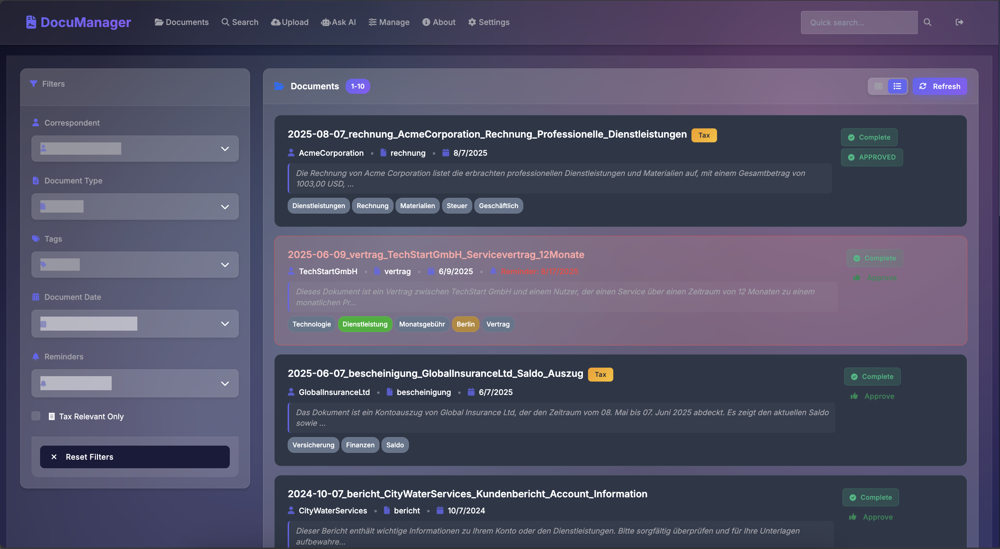
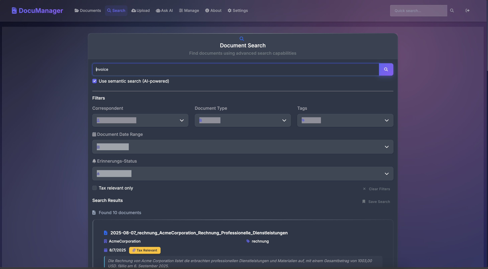
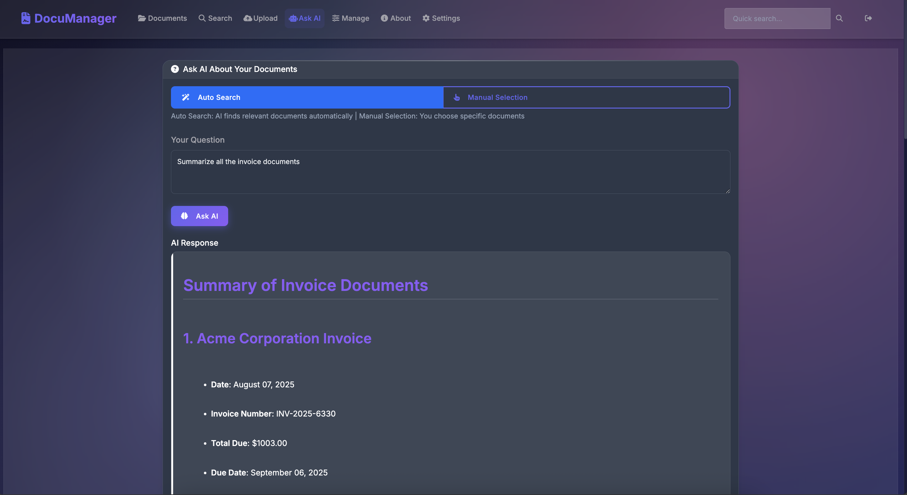
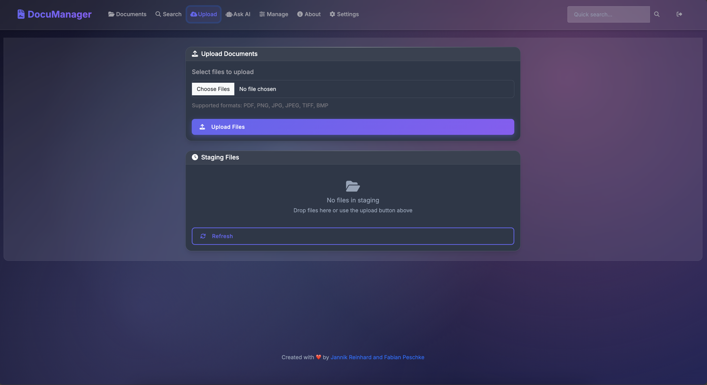
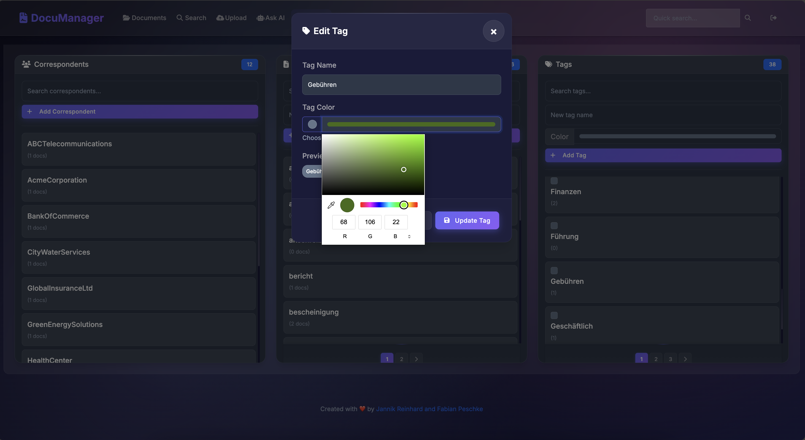
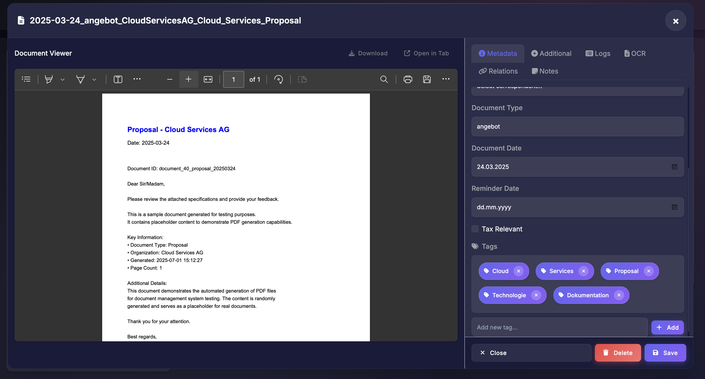
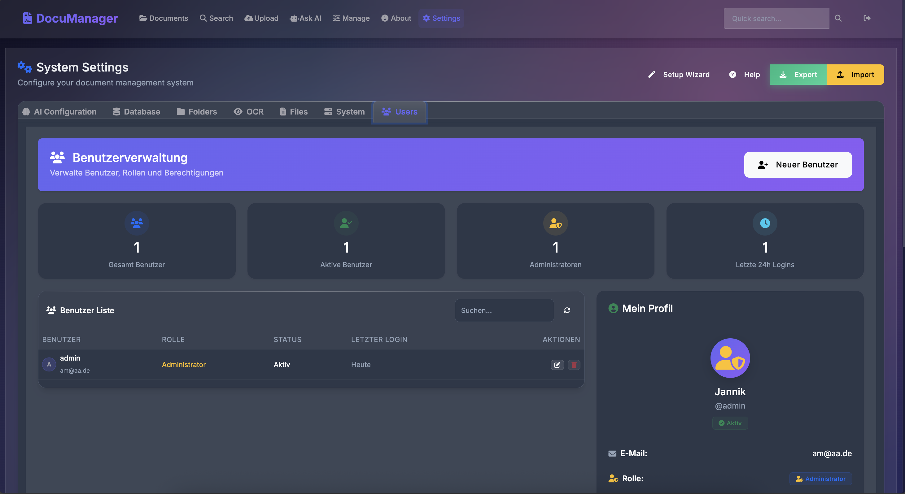
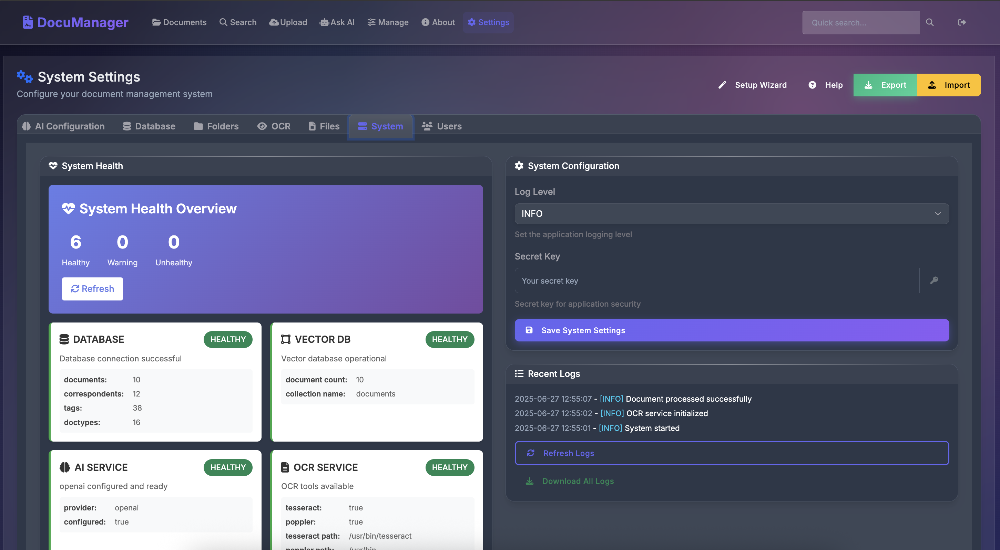

<!-- jr-brand:start -->
<div align="center">
  <a href="https://jannikreinhard.com/">
    
  </a>
  <h1>Document Manager</h1>
  <p><strong>Python-based document management tool for organizing, processing, and managing files.</strong></p>
  <p>
  <a href="https://jannikreinhard.com/"></a>
  <a href="https://github.com/JayRHa"></a>
  <a href="https://www.linkedin.com/in/jannik-r/"></a>
  <a href="https://x.com/jannik_reinhard"></a>
  <a href="https://www.youtube.com/@ModernDevMgmt/featured"></a>
</p>
  <p><sub>Tool · App · CLI · Python · Practical by design</sub></p>
</div>
<!-- jr-brand:end -->

> **Canonical repository:** This repository supersedes the legacy
> `JayRHa/DocumentManagement` project and contains the maintained application,
> runtime configuration, tests, and deployment path.

## Features

### AI-Powered Intelligence
- **Semantic Search**: Find documents by meaning, not just keywords. Search for "payment terms" and find invoicing documents, contracts with payment clauses, and financial agreements - even if they never use those exact words
- **Smart OCR**: Extract text from scanned PDFs, photos of whiteboards, and documents in 50+ languages using Tesseract OCR
- **Auto-Tagging**: AI automatically categorizes documents based on content - financial reports get tagged as "finance", contracts as "legal", technical specs as "engineering"
- **Natural Language Queries**: Just ask questions like "Show me all contracts expiring this year" or "What were our Q4 marketing expenses?"
- **AI-Generated Summaries**: Understand large documents at a glance with automatic summary generation

### Enterprise-Ready Security
- **Role-Based Access Control**: Fine-grained permissions for users and groups
- **Complete Audit Trails**: Track all document activities
- **Privacy First**: Option to use Azure OpenAI to keep models in your own tenant
- **Self-Hosted**: All data stays on your infrastructure - no vendor lock-in
- **Session Management**: Secure session handling with automatic expiry

### Modern Architecture
- **RESTful API**: Complete OpenAPI 3.0 documented API built with FastAPI
- **Vector Database**: ChromaDB for lightning-fast semantic search using embeddings
- **Flexible AI**: Choose between OpenAI or Azure OpenAI (your choice)
- **Simple Frontend**: Vanilla JavaScript keeping it simple and fast
- **Docker-Ready**: Deploy in minutes with included setup script

## Demo


### Dashboard Overview

*Clean, intuitive dashboard showing document statistics and recent activities*

### AI-Powered Search

*Find documents by meaning, not just keywords - ask questions in natural language*

### AI Chat

*Interactive AI chat for document analysis and knowledge extraction*

### Document Upload & Processing

*Drag-and-drop interface with automatic text extraction and AI tagging*

### Smart Tags & Organization

*AI auto-generates correspondents, document types, and tags - fully customizable with color coding*

### Document Viewer

*Built-in document viewer with search highlighting and annotations*

### User Management

*Enterprise-grade user and permission management*

### Settings & Configuration

*Easy configuration of AI providers and system settings*


## Quickstart

### Getting Started in 3 Minutes

The beauty of open source? You can have this running on your machine right now:

### Prerequisites
- Docker installed and running
- 4GB+ RAM recommended
- 10GB+ free disk space

### Using Docker (Recommended)

```bash
# Clone the repository
git clone https://github.com/JayRHa/DocumentManager.git
cd DocumentManager

# Build and run with a generated local .env file
./setup.sh build
./setup.sh prod

# Or manually with Docker
docker build -t documentmanager:local .
cp .env.example .env
# Set a strong SECRET_KEY and optional AI credentials in .env first.
docker run -d \
  --name documentmanager-local \
  -p 127.0.0.1:8000:8000 \
  --env-file .env \
  -v $(pwd)/data:/app/data \
  -v $(pwd)/backups:/app/data/backups \
  documentmanager:local
```

The application will be available at `http://localhost:8000`

To verify a local Docker install with real sample documents, run:

```bash
python3 scripts/local_smoke_test.py \
  --base-url http://127.0.0.1:8000 \
  --data-dir data \
  --sample-dir ~/projects/comedy/docs
```

The smoke test creates or reuses a local development admin account, stores the
generated local credentials in ignored runtime state under `data/`, stages a
small Markdown/text sample set, waits for OCR/text extraction, then verifies
authenticated document listing and full-text search. If you run it against an
existing database with different admin credentials, set `DM_SMOKE_USERNAME` and
`DM_SMOKE_PASSWORD` for an existing admin.

### Windows Notes

- Use `./setup.ps1` instead of `./setup.sh` in PowerShell:

```powershell
./setup.ps1 build
./setup.ps1 prod
```

- Or run locally without Docker:

```powershell
python -m venv venv
venv\Scripts\Activate
pip install -r requirements.txt
python cli.py serve
```

- OCR tools on Windows:
  - Tesseract: `winget install tesseract-ocr` or `choco install tesseract`
  - Poppler (for PDF OCR): `choco install poppler` or download binaries and set Settings.poppler_path to the poppler `bin` folder

### Using the Setup Script

The `setup.sh` script provides an easy way to manage your DocumentManager installation:

```bash
# Start development environment with hot reload
./setup.sh dev

# Start production environment
./setup.sh prod

# Build Docker image
./setup.sh build

# View logs
./setup.sh logs

# Check status
./setup.sh status

# Stop all containers
./setup.sh stop
```

### Local Development

```bash
# Create virtual environment
python -m venv venv
source venv/bin/activate  # On Windows: venv\Scripts\activate

# Install dependencies
pip install -r requirements.txt

# Run development server
uvicorn app.main:app --reload --host 127.0.0.1 --port 8000
```

## Initial Setup

1. **Create Admin Account**
   - Navigate to `http://localhost:8000`
   - The first user registration automatically becomes admin

2. **Configure AI Provider**
   - Go to Settings → AI Configuration
   - Choose between OpenAI or Azure OpenAI
   - Enter your API credentials
   - Test the connection

3. **Start Using**
   - Upload documents via drag-and-drop
   - Watch AI automatically extract text, generate summaries, and categorize
   - AI detects: Title, Summary, Correspondent, Document Type, Document Date, Tags, and Tax Relevance
   - Use semantic search to find information instantly with natural language

## Architecture

```
DocumentManager/
├── app/                    # FastAPI backend
│   ├── middleware/        # Authentication, CSRF, rate limiting, logging
│   ├── routers/           # REST API endpoints
│   ├── services/          # AI, OCR, search, and document processing
│   └── utils/             # Backup, validation, and file security
├── frontend/              # Vanilla JavaScript frontend
├── tests/                 # Regression tests
├── Dockerfile             # Production container
├── Dockerfile.dev         # Development container
└── setup.sh / setup.ps1   # Runtime helpers
```

### Technology Stack

- **Backend**: FastAPI, SQLAlchemy, Pydantic
- **AI/ML**: OpenAI GPT-4, Azure OpenAI, ChromaDB
- **OCR**: Tesseract (50+ languages)
- **Database**: SQLite
- **Frontend**: Vanilla JavaScript, modern CSS
- **Deployment**: Docker or Podman

## Configuration

### Environment Variables

Copy `.env.example` to `.env`. The setup script does this automatically and
generates a strong `SECRET_KEY` when `.env` does not exist.

```bash
cp .env.example .env
python -c 'import secrets; print(secrets.token_urlsafe(32))'
```

Place the generated value in `SECRET_KEY` and configure the required provider:

```dotenv
SECRET_KEY=replace-with-generated-value
ENVIRONMENT=production

# Database
DATABASE_URL=sqlite:///./data/documents.db

# AI Provider
AI_PROVIDER=openai
OPENAI_API_KEY=sk-...
# Or for Azure:
# AI_PROVIDER=azure
# AZURE_OPENAI_ENDPOINT=https://your-resource.openai.azure.com
# AZURE_OPENAI_API_KEY=your-key
# AZURE_OPENAI_CHAT_DEPLOYMENT=your-chat-deployment
# AZURE_OPENAI_EMBEDDINGS_DEPLOYMENT=your-embedding-deployment

# Application Settings
LOG_LEVEL=INFO
MAX_FILE_SIZE=100MB
ALLOWED_EXTENSIONS=pdf,png,jpg,jpeg,tiff,bmp,txt,text,md,markdown
```

## API Documentation

### Interactive API Docs
Once running, access the interactive API documentation at:
- Swagger UI: `http://localhost:8000/docs`
- ReDoc: `http://localhost:8000/redoc`

### Quick API Examples

```python
import requests

# Base URL
BASE_URL = "http://localhost:8000"

# 1. Authentication
response = requests.post(f"{BASE_URL}/api/auth/login", json={
    "username": "admin",
    "password": "your-password"
})
session = requests.Session()
session.cookies = response.cookies

# 2. Upload Document
with open("document.pdf", "rb") as f:
    response = session.post(
        f"{BASE_URL}/api/documents/upload",
        files={"file": f},
        data={"title": "Q4 Report", "tags": "finance,quarterly"}
    )
    document_id = response.json()["id"]

# 3. Semantic Search
response = session.get(f"{BASE_URL}/api/search/semantic", params={
    "query": "What were the Q4 revenue numbers?",
    "limit": 5
})
results = response.json()

# 4. Ask Questions
response = session.post(f"{BASE_URL}/api/ai/ask", json={
    "question": "Summarize the key findings from Q4 reports",
    "document_ids": [document_id]
})
answer = response.json()["answer"]
```

## Why Open Source?

Your document management system shouldn't be a black box. With DocumentManager you can:
- **Audit the code** - Know exactly what happens to your documents
- **Customize for your needs** - Modify anything to fit your workflow
- **Self-host everything** - Your documents, your rules
- **Contribute improvements** - Join the community making document management better

No vendor lock-in. Complete transparency. Total control.

## Roadmap

The foundation is solid, but we're just getting started:
- **Self-hosted AI models** - Run everything locally
- **Mobile apps** - For on-the-go access and document scanning
- **Workflow automation** - Documents that route themselves
- **Advanced analytics** - Insights from your document repository
- **Plugin system** - Custom integrations for your needs

## Contributing

We love contributions! Please see our [Contributing Guide](https://github.com/JayRHa/.github/blob/main/CONTRIBUTING.md) for details.

1. Fork the repository
2. Create your feature branch (`git checkout -b feature/AmazingFeature`)
3. Commit your changes (`git commit -m 'Add some AmazingFeature'`)
4. Push to the branch (`git push origin feature/AmazingFeature`)
5. Open a Pull Request

### Development Setup

```bash
# Clone your fork
git clone https://github.com/JayRHa/DocumentManager.git
cd DocumentManager

# Create branch
git checkout -b feature/your-feature

# Install pre-commit hooks
pip install pre-commit
pre-commit install
```

## License

This project is licensed under the MIT License - see the [LICENSE](LICENSE) file for details.

Built with ❤️ by Jannik Reinhard and Fabian Peschke

⭐ Star the repo if you find it useful — it really helps with motivation!

☕ If you want to support the project, you can [buy us a coffee](https://www.buymeacoffee.com/your-link)

<!-- jr-brand-footer:start -->

---

<div align="center">
  <p><sub>Built and maintained by <a href="https://jannikreinhard.com/">Jannik Reinhard</a> · Microsoft MVP for Security and AI Platform.</sub></p>
  <p><a href="https://www.buymeacoffee.com/jannikreinf">Support the open-source work</a></p>
  <p><strong>Stay healthy, Cheers Jannik</strong></p>
</div>

<!-- jr-brand-footer:end -->
